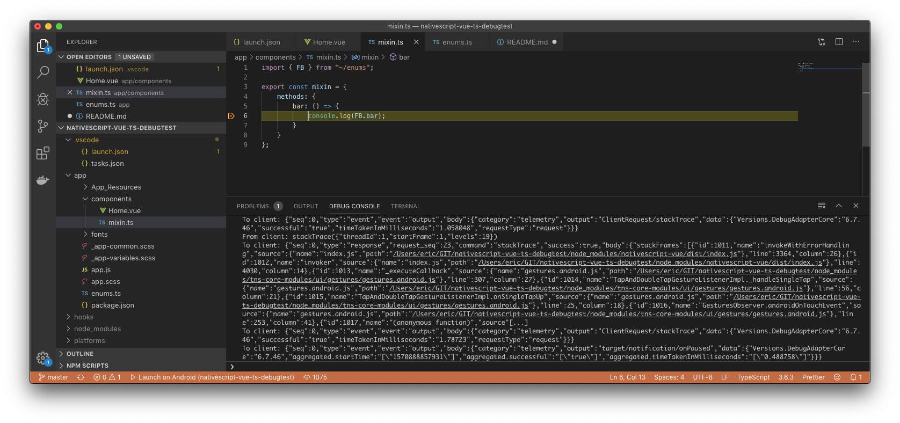

# nativescript-vue-ts-debugtest

Repo for testing debugging with:

- Nativescript
- Vue
- TypeScript
- Webpack

## Why?
In a large Nativescript project I have trouble getting the debugger to work for Vue web components. I seem to be not the
only one, as I've found many online articles, Stack Overflow questions and GitHub issues about:

- Breakpoint jumping when setting
- Source maps not correctly generated
- Webpack loaders not working properly

Next to that, it looks like debugging documentation from Nativescript is outdated. It proposes e.g. to use the TypeScript
plugin for NativeScript, but this is deprecated in favor of the TNS 6 bundle workflow. 

I really really really want step debugging, so I created a separate Nativescript project without my other project's full
code base to focus on getting this to work.

## What I'm able to do:

- Launch my app in debug mode from the shell and attach from VS Code
- Launch my app in debug mode from VS Code directly
- Set breakpoints in .ts files
- Get application execution to halt on breakpoints in source .ts files
- Get application execution to halt on _debugger;_ statements in both .ts files and .vue single file components

## What I'm not able to do:

- Get application execution to halt on Visual Studio code-set breakpoints in source .vue files

## What have I done so far?

- Installed VS Code Nativescript extension
- Installed VS Code Chrome debugger extension
- Added debugger launch configuration

```
{
    "name": "Launch on Android",
    "type": "nativescript",
    "request": "launch",
    "platform": "android",
    "appRoot": "${workspaceRoot}",
    "sourceMaps": true,
    "watch": true,
    "sourceMapPathOverrides": {
        "webpack:///*": "${workspaceRoot}/app/*"
    },
    "tnsArgs": [
        "--bundle",   // Bundle the code
        "--no-hmr",   // I don't want HMR (yet) - at least not for debugging
        "--log=trace" // Print detailed diagnostic log for the execution of the current command
    ],
    // Enable verbose tracing of messages over Chrome debugging protocol - shows source mapping
    // results for breakpoint setting
    "trace": "verbose"
}
```

## Breakpoint setting in TypeScript file (successful)

Result when setting a breakpoint in /app/components/mixin.ts, line 6:

```
From client: setBreakpoints({"source":{"name":"mixin.ts","path":"/Users/eric/GIT/nativescript-vue-ts-debugtest/app/components/mixin.ts"},"lines":[6],"breakpoints":[{"line":6}],"sourceModified":false})
To client: {"seq":0,"type":"event","event":"output","body":{"category":"telemetry","output":"setBreakpointsRequest","data":{"Versions.DebugAdapterCore":"6.7.46","fileExt":".ts"}}}
SourceMaps.setBP: Mapped /Users/eric/GIT/nativescript-vue-ts-debugtest/app/components/mixin.ts to /Users/eric/GIT/nativescript-vue-ts-debugtest/platforms/android/app/src/main/assets/app/bundle.js
SourceMaps.setBP: Mapped /Users/eric/GIT/nativescript-vue-ts-debugtest/app/components/mixin.ts:6:1 to /Users/eric/GIT/nativescript-vue-ts-debugtest/platforms/android/app/src/main/assets/app/bundle.js:325:13
Paths.setBP: Resolved /Users/eric/GIT/nativescript-vue-ts-debugtest/platforms/android/app/src/main/assets/app/bundle.js to file:///data/data/org.nativescript.debugtest/files/app/bundle.js
→ To target: "{\"id\":91,\"method\":\"Debugger.removeBreakpoint\",\"params\":{\"breakpointId\":\"2:21:17:file:\\\\/\\\\/\\\\/data\\\\/data\\\\/org\\\\.nativescript\\\\.debugtest\\\\/files\\\\/app\\\\/bundle\\\\.js\"}}"
← From target: {"id":91,"result":{}}
→ To target: "{\"id\":92,\"method\":\"Debugger.getPossibleBreakpoints\",\"params\":{\"start\":{\"scriptId\":\"8\",\"lineNumber\":324,\"columnNumber\":0},\"end\":{\"scriptId\":\"8\",\"lineNumber\":325,\"columnNumber\":0},\"restrictToFunction\":false}}"
→ To target: "{\"id\":93,\"method\":\"Debugger.getPossibleBreakpoints\",\"params\":{\"start\":{\"scriptId\":\"8\",\"lineNumber\":21,\"columnNumber\":0},\"end\":{\"scriptId\":\"8\",\"lineNumber\":22,\"columnNumber\":0},\"restrictToFunction\":false}}"
→ To target: "{\"id\":94,\"method\":\"Debugger.getPossibleBreakpoints\",\"params\":{\"start\":{\"scriptId\":\"8\",\"lineNumber\":21,\"columnNumber\":0},\"end\":{\"scriptId\":\"8\",\"lineNumber\":22,\"columnNumber\":0},\"restrictToFunction\":false}}"
→ To target: "{\"id\":95,\"method\":\"Debugger.getPossibleBreakpoints\",\"params\":{\"start\":{\"scriptId\":\"8\",\"lineNumber\":21,\"columnNumber\":0},\"end\":{\"scriptId\":\"8\",\"lineNumber\":22,\"columnNumber\":0},\"restrictToFunction\":false}}"
→ To target: "{\"id\":96,\"method\":\"Debugger.getPossibleBreakpoints\",\"params\":{\"start\":{\"scriptId\":\"8\",\"lineNumber\":21,\"columnNumber\":0},\"end\":{\"scriptId\":\"8\",\"lineNumber\":22,\"columnNumber\":0},\"restrictToFunction\":false}}"
→ To target: "{\"id\":97,\"method\":\"Debugger.getPossibleBreakpoints\",\"params\":{\"start\":{\"scriptId\":\"8\",\"lineNumber\":21,\"columnNumber\":0},\"end\":{\"scriptId\":\"8\",\"lineNumber\":22,\"columnNumber\":0},\"restrictToFunction\":false}}"
→ To target: "{\"id\":98,\"method\":\"Debugger.getPossibleBreakpoints\",\"params\":{\"start\":{\"scriptId\":\"8\",\"lineNumber\":21,\"columnNumber\":0},\"end\":{\"scriptId\":\"8\",\"lineNumber\":22,\"columnNumber\":0},\"restrictToFunction\":false}}"
→ To target: "{\"id\":99,\"method\":\"Debugger.getPossibleBreakpoints\",\"params\":{\"start\":{\"scriptId\":\"8\",\"lineNumber\":21,\"columnNumber\":0},\"end\":{\"scriptId\":\"8\",\"lineNumber\":22,\"columnNumber\":0},\"restrictToFunction\":false}}"
← From target: {"id":92,"result":{"locations":[]}}
→ To target: "{\"id\":100,\"method\":\"Debugger.setBreakpointByUrl\",\"params\":{\"urlRegex\":\"file:\\\\/\\\\/\\\\/data\\\\/data\\\\/org\\\\.nativescript\\\\.debugtest\\\\/files\\\\/app\\\\/bundle\\\\.js\",\"lineNumber\":324,\"columnNumber\":12}}"
← From target: {"id":93,"result":{"locations":[]}}
→ To target: "{\"id\":101,\"method\":\"Debugger.setBreakpointByUrl\",\"params\":{\"urlRegex\":\"file:\\\\/\\\\/\\\\/data\\\\/data\\\\/org\\\\.nativescript\\\\.debugtest\\\\/files\\\\/app\\\\/bundle\\\\.js\",\"lineNumber\":21,\"columnNumber\":17}}"
← From target: {"id":94,"result":{"locations":[]}}
→ To target: "{\"id\":102,\"method\":\"Debugger.setBreakpointByUrl\",\"params\":{\"urlRegex\":\"file:\\\\/\\\\/\\\\/data\\\\/data\\\\/org\\\\.nativescript\\\\.debugtest\\\\/files\\\\/app\\\\/bundle\\\\.js\",\"lineNumber\":21,\"columnNumber\":17}}"
← From target: {"id":95,"result":{"locations":[]}}
→ To target: "{\"id\":103,\"method\":\"Debugger.setBreakpointByUrl\",\"params\":{\"urlRegex\":\"file:\\\\/\\\\/\\\\/data\\\\/data\\\\/org\\\\.nativescript\\\\.debugtest\\\\/files\\\\/app\\\\/bundle\\\\.js\",\"lineNumber\":21,\"columnNumber\":17}}"
← From target: {"id":96,"result":{"locations":[]}}
→ To target: "{\"id\":104,\"method\":\"Debugger.setBreakpointByUrl\",\"params\":{\"urlRegex\":\"file:\\\\/\\\\/\\\\/data\\\\/data\\\\/org\\\\.nativescript\\\\.debugtest\\\\/files\\\\/app\\\\/bundle\\\\.js\",\"lineNumber\":21,\"columnNumber\":17}}"
← From target: {"id":97,"result":{"locations":[]}}
→ To target: "{\"id\":105,\"method\":\"Debugger.setBreakpointByUrl\",\"params\":{\"urlRegex\":\"file:\\\\/\\\\/\\\\/data\\\\/data\\\\/org\\\\.nativescript\\\\.debugtest\\\\/files\\\\/app\\\\/bundle\\\\.js\",\"lineNumber\":21,\"columnNumber\":17}}"
← From target: {"id":98,"result":{"locations":[]}}
→ To target: "{\"id\":106,\"method\":\"Debugger.setBreakpointByUrl\",\"params\":{\"urlRegex\":\"file:\\\\/\\\\/\\\\/data\\\\/data\\\\/org\\\\.nativescript\\\\.debugtest\\\\/files\\\\/app\\\\/bundle\\\\.js\",\"lineNumber\":21,\"columnNumber\":17}}"
← From target: {"id":99,"result":{"locations":[]}}
→ To target: "{\"id\":107,\"method\":\"Debugger.setBreakpointByUrl\",\"params\":{\"urlRegex\":\"file:\\\\/\\\\/\\\\/data\\\\/data\\\\/org\\\\.nativescript\\\\.debugtest\\\\/files\\\\/app\\\\/bundle\\\\.js\",\"lineNumber\":21,\"columnNumber\":17}}"
← From target: {"id":100,"result":{"breakpointId":"2:324:12:file:\\/\\/\\/data\\/data\\/org\\.nativescript\\.debugtest\\/files\\/app\\/bundle\\.js","locations":[{"scriptId":"8","lineNumber":324,"columnNumber":12}]}}
← From target: {"id":101,"result":{"breakpointId":"2:21:17:file:\\/\\/\\/data\\/data\\/org\\.nativescript\\.debugtest\\/files\\/app\\/bundle\\.js","locations":[{"scriptId":"8","lineNumber":24,"columnNumber":6}]}}
← From target: {"error":{"code":-32000,"message":"Breakpoint at specified location already exists."},"id":102}
← From target: {"error":{"code":-32000,"message":"Breakpoint at specified location already exists."},"id":103}
← From target: {"error":{"code":-32000,"message":"Breakpoint at specified location already exists."},"id":104}
← From target: {"error":{"code":-32000,"message":"Breakpoint at specified location already exists."},"id":105}
← From target: {"error":{"code":-32000,"message":"Breakpoint at specified location already exists."},"id":106}
← From target: {"error":{"code":-32000,"message":"Breakpoint at specified location already exists."},"id":107}
SourceMaps.setBP: Mapped /Users/eric/GIT/nativescript-vue-ts-debugtest/platforms/android/app/src/main/assets/app/bundle.js:325:13 to /Users/eric/GIT/nativescript-vue-ts-debugtest/app/components/mixin.ts:6
To client: {"seq":0,"type":"response","request_seq":33,"command":"setBreakpoints","success":true,"body":{"breakpoints":[{"id":1000,"verified":true,"line":6,"column":13}]}}
To client: {"seq":0,"type":"event","event":"output","body":{"category":"telemetry","output":"ClientRequest/setBreakpoints","data":{"Versions.DebugAdapterCore":"6.7.46","successful":"true","timeTakenInMilliseconds":"271.1162","requestType":"request"}}}
```

Result of hitting the breakpoint during execution:

```
To client: {"seq":0,"type":"response","request_seq":22,"command":"stackTrace","success":true,"body":{"stackFrames":[{"id":1000,"name":"bar","source":{"name":"mixin.ts","path":"/Users/eric/GIT/nativescript-vue-ts-debugtest/app/components/mixin.ts"},"line":6,"column":13}],"totalFrames":10}}
To client: {"seq":0,"type":"event","event":"output","body":{"category":"telemetry","output":"ClientRequest/stackTrace","data":{"Versions.DebugAdapterCore":"6.7.46","successful":"true","timeTakenInMilliseconds":"1.058048","requestType":"request"}}}
From client: stackTrace({"threadId":1,"startFrame":1,"levels":19})
To client: {"seq":0,"type":"response","request_seq":23,"command":"stackTrace","success":true,"body":{"stackFrames":[{"id":1011,"name":"invokeWithErrorHandling","source":{"name":"index.js","path":"/Users/eric/GIT/nativescript-vue-ts-debugtest/node_modules/nativescript-vue/dist/index.js"},"line":3364,"column":26},{"id":1012,"name":"invoker","source":{"name":"index.js","path":"/Users/eric/GIT/nativescript-vue-ts-debugtest/node_modules/nativescript-vue/dist/index.js"},"line":4030,"column":14},{"id":1013,"name":"_executeCallback","source":{"name":"gestures.android.js","path":"/Users/eric/GIT/nativescript-vue-ts-debugtest/node_modules/tns-core-modules/ui/gestures/gestures.android.js"},"line":307,"column":27},{"id":1014,"name":"TapAndDoubleTapGestureListenerImpl._handleSingleTap","source":{"name":"gestures.android.js","path":"/Users/eric/GIT/nativescript-vue-ts-debugtest/node_modules/tns-core-modules/ui/gestures/gestures.android.js"},"line":56,"column":21},{"id":1015,"name":"TapAndDoubleTapGestureListenerImpl.onSingleTapUp","source":{"name":"gestures.android.js","path":"/Users/eric/GIT/nativescript-vue-ts-debugtest/node_modules/tns-core-modules/ui/gestures/gestures.android.js"},"line":25,"column":18},{"id":1016,"name":"GesturesObserver.androidOnTouchEvent","source":{"name":"gestures.android.js","path":"/Users/eric/GIT/nativescript-vue-ts-debugtest/node_modules/tns-core-modules/ui/gestures/gestures.android.js"},"line":253,"column":41},{"id":1017,"name":"(anonymous function)","source"[...]
To client: {"seq":0,"type":"event","event":"output","body":{"category":"telemetry","output":"ClientRequest/stackTrace","data":{"Versions.DebugAdapterCore":"6.7.46","successful":"true","timeTakenInMilliseconds":"1.78723","requestType":"request"}}}
To client: {"seq":0,"type":"event","event":"output","body":{"category":"telemetry","output":"target/notification/onPaused","data":{"Versions.DebugAdapterCore":"6.7.46","aggregated.startTime":"[\"1570888857931\"]","aggregated.successful":"[\"true\"]","aggregated.timeTakenInMilliseconds":"[\"0.488758\"]"}}}
```

Visual proof:



## Breakpoint setting in Vue file (unsuccessful)

```
From client: setBreakpoints({"source":{"name":"Home.vue","path":"/Users/eric/GIT/nativescript-vue-ts-debugtest/app/components/Home.vue"},"lines":[34],"breakpoints":[{"line":34}],"sourceModified":false})
To client: {"seq":0,"type":"event","event":"output","body":{"category":"telemetry","output":"setBreakpointsRequest","data":{"Versions.DebugAdapterCore":"6.7.46","fileExt":".vue"}}}
SourceMaps.setBP: Mapped /Users/eric/GIT/nativescript-vue-ts-debugtest/app/components/Home.vue to /Users/eric/GIT/nativescript-vue-ts-debugtest/platforms/android/app/src/main/assets/app/bundle.js
SourceMaps.setBP: Mapped /Users/eric/GIT/nativescript-vue-ts-debugtest/app/components/Home.vue:34:1 to /Users/eric/GIT/nativescript-vue-ts-debugtest/platforms/android/app/src/main/assets/app/bundle.js:22:18
Paths.setBP: Resolved /Users/eric/GIT/nativescript-vue-ts-debugtest/platforms/android/app/src/main/assets/app/bundle.js to file:///data/data/org.nativescript.debugtest/files/app/bundle.js
→ To target: "{\"id\":112,\"method\":\"Debugger.removeBreakpoint\",\"params\":{\"breakpointId\":\"2:324:12:file:\\\\/\\\\/\\\\/data\\\\/data\\\\/org\\\\.nativescript\\\\.debugtest\\\\/files\\\\/app\\\\/bundle\\\\.js\"}}"
← From target: {"id":112,"result":{}}
→ To target: "{\"id\":113,\"method\":\"Debugger.getPossibleBreakpoints\",\"params\":{\"start\":{\"scriptId\":\"8\",\"lineNumber\":21,\"columnNumber\":0},\"end\":{\"scriptId\":\"8\",\"lineNumber\":22,\"columnNumber\":0},\"restrictToFunction\":false}}"
→ To target: "{\"id\":114,\"method\":\"Debugger.getPossibleBreakpoints\",\"params\":{\"start\":{\"scriptId\":\"8\",\"lineNumber\":324,\"columnNumber\":0},\"end\":{\"scriptId\":\"8\",\"lineNumber\":325,\"columnNumber\":0},\"restrictToFunction\":false}}"
← From target: {"id":113,"result":{"locations":[]}}
→ To target: "{\"id\":115,\"method\":\"Debugger.setBreakpointByUrl\",\"params\":{\"urlRegex\":\"file:\\\\/\\\\/\\\\/data\\\\/data\\\\/org\\\\.nativescript\\\\.debugtest\\\\/files\\\\/app\\\\/bundle\\\\.js\",\"lineNumber\":21,\"columnNumber\":17}}"
← From target: {"id":114,"result":{"locations":[]}}
→ To target: "{\"id\":116,\"method\":\"Debugger.setBreakpointByUrl\",\"params\":{\"urlRegex\":\"file:\\\\/\\\\/\\\\/data\\\\/data\\\\/org\\\\.nativescript\\\\.debugtest\\\\/files\\\\/app\\\\/bundle\\\\.js\",\"lineNumber\":324,\"columnNumber\":12}}"
← From target: {"id":115,"result":{"breakpointId":"2:21:17:file:\\/\\/\\/data\\/data\\/org\\.nativescript\\.debugtest\\/files\\/app\\/bundle\\.js","locations":[{"scriptId":"8","lineNumber":24,"columnNumber":6}]}}
← From target: {"id":116,"result":{"breakpointId":"2:324:12:file:\\/\\/\\/data\\/data\\/org\\.nativescript\\.debugtest\\/files\\/app\\/bundle\\.js","locations":[{"scriptId":"8","lineNumber":324,"columnNumber":12}]}}
SourceMaps.setBP: Can't map /Users/eric/GIT/nativescript-vue-ts-debugtest/platforms/android/app/src/main/assets/app/bundle.js:25:7, keeping original line numbers.
To client: {"seq":0,"type":"response","request_seq":35,"command":"setBreakpoints","success":true,"body":{"breakpoints":[{"id":1001,"verified":true,"line":34}]}}
To client: {"seq":0,"type":"event","event":"output","body":{"category":"telemetry","output":"ClientRequest/setBreakpoints","data":{"Versions.DebugAdapterCore":"6.7.46","successful":"true","timeTakenInMilliseconds":"137.606582","requestType":"request"}}}
```

Note:

- breakpoint indicator is set in source code
- logging however states *can't map*
- The following line seems odd, as at 22:18 in bundle.js there is no similar line of code compared to the breakpointed line:
```
SourceMaps.setBP: Mapped /Users/eric/GIT/nativescript-vue-ts-debugtest/app/components/Home.vue:34:1 to /Users/eric/GIT/nativescript-vue-ts-debugtest/platforms/android/app/src/main/assets/app/bundle.js:22:18
```

Checked:
- https://github.com/microsoft/vscode-chrome-debug/issues/247

Result of trying to hit the breakpoint in execution:

```
← From target: {"method":"Log.entryAdded","params":{"entry":{"source":"javascript","level":"info","text":"0","timestamp":1570889034294,"url":"file:///data/data/org.nativescript.debugtest/files/app/vendor.js","lineNumber":14496}}}
To client: {"seq":0,"type":"event","event":"output","body":{"category":"stdout","output":"0 [file:///data/data/org.nativescript.debugtest/files/app/vendor.js]\n"}}
0 [file:///data/data/org.nativescript.debugtest/files/app/vendor.js]
To client: {"seq":0,"type":"event","event":"output","body":{"category":"stdout","output":"0\n","source":{"name":"index.js","path":"/Users/eric/GIT/nativescript-vue-ts-debugtest/node_modules/nativescript-vue/dist/index.js"},"line":14241,"column":5}}
```
- Using _debugger;_ statement works - code breaks on the proper point

As workaround this is fine now, but I do want to get this solved...
